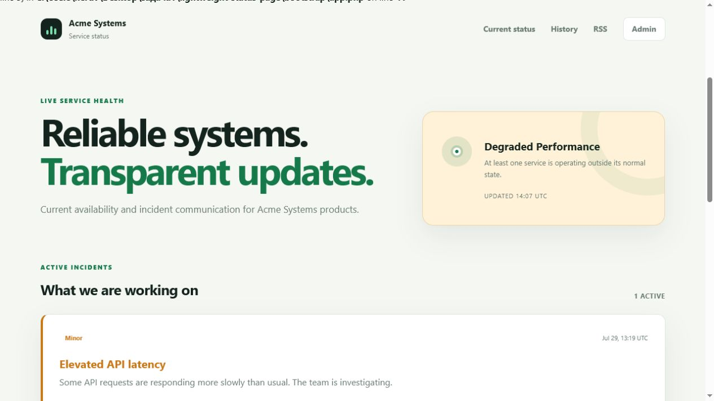
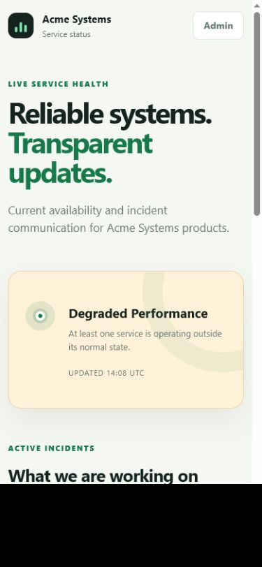
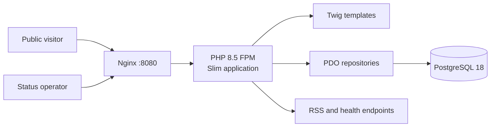
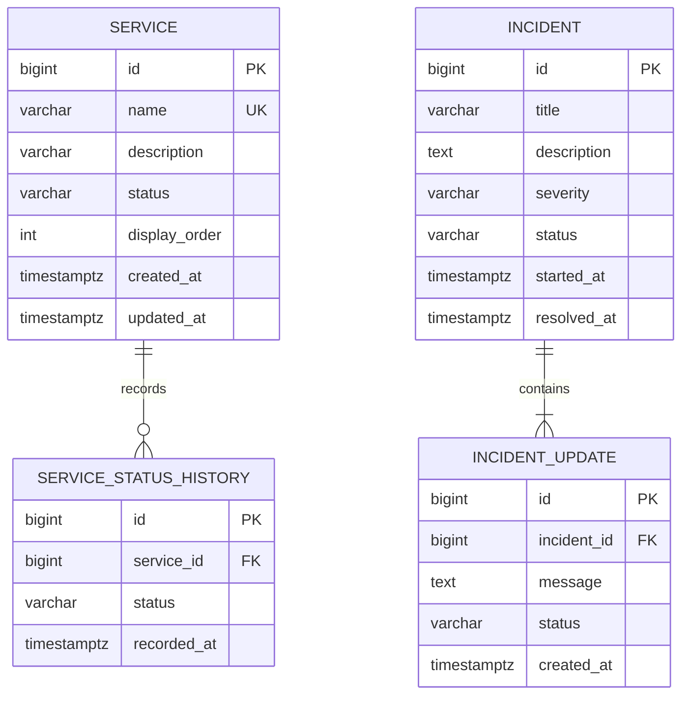

# Lightweight Status Page

[](https://github.com/German4341374/lightweight-status-page/actions/workflows/ci.yml)
[](https://www.php.net/)
[](https://www.slimframework.com/)
[](LICENSE)

A status page you can host yourself. Visitors can see whether your services are working,
read incident updates, and check recent history. An admin signs in to change a status
or post an update.

It's a PHP app using Slim, Twig, and PostgreSQL, with Nginx in front. Docker Compose runs
the whole setup locally.



<details>
<summary>Mobile status page</summary>



</details>

## Features

- Public overview with an aggregate health message and ordered service list.
- Service states: Operational, Degraded Performance, Partial Outage, Major Outage, and Maintenance.
- 90-day uptime calculated from status history; planned maintenance is excluded from the denominator.
- Active incident communication and a 90-day incident timeline.
- Incident severities, lifecycle states, timestamped updates, and resolution workflow.
- Password-protected administration page for services and incidents.
- RSS 2.0 incident feed at `/feed.xml`.
- Database-aware JSON health endpoint at `/health`.
- PostgreSQL migrations and representative development seed data.
- Responsive Twig UI with no client-side JavaScript dependency.

## Architecture



Slim provides routing and PSR-7 request handling. Controllers are intentionally expressed as a
small route composition layer, while persistence, authentication, uptime calculation, validation,
and migrations live in dedicated classes.

## Data model



`login_attempts` stores only an HMAC-SHA256 representation of the remote address and a timestamp.
It supports login throttling without persisting raw addresses.

## Technology stack

- PHP 8.5.8 and PHP-FPM
- Slim 4.15.2 with Slim PSR-7
- Twig 3
- PostgreSQL 18
- Nginx
- PHPUnit 13, PHPStan 2, and PHP-CS-Fixer 3
- Docker Compose and GitHub Actions

Important package versions are recorded in `composer.lock`; container images use explicit tags.

## Docker setup

Requirements:

- Docker Engine 25 or newer with Docker Compose v2
- Git
- Windows users: Docker Desktop with the WSL2 backend, or Docker Engine inside WSL2

Start the complete stack:

```bash
cp .env.example .env
docker compose up --build --detach
docker compose ps
curl --fail http://localhost:8080/health
```

Open:

- Status page: <http://localhost:8080>
- Incident history: <http://localhost:8080/history>
- Administration: <http://localhost:8080/admin/login>
- RSS feed: <http://localhost:8080/feed.xml>

Stop the environment:

```bash
docker compose down
```

Remove the development database as well:

```bash
docker compose down --volumes
```

The PHP container applies pending migrations before starting PHP-FPM. The operation is idempotent:
applied filenames are recorded in `schema_migrations`.

## Development demo credentials

The committed example is only for local development:

```text
Username: status-admin
Password: demo-status-only
```

Never reuse this password outside a disposable local environment. Generate a production hash with:

```bash
php -r "echo password_hash('a-long-unique-password', PASSWORD_DEFAULT), PHP_EOL;"
```

Place the resulting hash in an uncommitted `.env` or secret-management system. A hash is still
security-sensitive configuration because it enables offline password guessing.

## Running without Docker

Install PHP 8.5 with `pdo_pgsql`, Composer, and PostgreSQL, then:

```bash
composer install
cp .env.example .env
php bin/migrate.php
php -S 127.0.0.1:8080 -t public public/router.php
```

Update `DB_DSN`, `DB_USER`, and `DB_PASSWORD` in `.env` for the local PostgreSQL instance.
`bin/setup-preview.php` creates a SQLite database solely for visual development; PostgreSQL remains
the production and CI persistence engine.

## Routes

| Method | Route | Access | Purpose |
|---|---|---|---|
| GET | `/` | Public | Current service and incident overview |
| GET | `/history` | Public | Incidents from the last 90 days |
| GET | `/feed.xml` | Public | RSS incident feed |
| GET | `/health` | Public | Application and database health |
| GET/POST | `/admin/login` | Public | Rate-limited administrator sign-in |
| GET | `/admin` | Admin | Service and incident controls |
| POST | `/admin/services` | Admin | Add a service |
| POST | `/admin/services/{id}/status` | Admin | Change service status |
| POST | `/admin/incidents` | Admin | Publish an incident |
| POST | `/admin/incidents/{id}/updates` | Admin | Add an incident update |
| POST | `/admin/incidents/{id}/resolve` | Admin | Resolve an incident |

All state-changing routes require a session-bound CSRF token.

## Tests and quality checks

```bash
composer cs-check
composer analyse
composer test
composer audit --locked
composer verify
```

`composer verify` runs PHP-CS-Fixer in check mode, PHPStan at level 8, and PHPUnit. Tests cover:

- uptime calculation and maintenance exclusion;
- service and incident states;
- input validation;
- password verification and CSRF behavior;
- idempotent service status changes;
- incident creation, update, and resolution persistence.

GitHub Actions additionally applies migrations to a real PostgreSQL service and builds the complete
Nginx/PHP-FPM/PostgreSQL stack before checking the public page, history, login page, RSS feed, and
health endpoint.

## Security decisions

- Passwords are verified only with `password_verify`; plaintext credentials are never stored.
- Session cookies use `HttpOnly`, `SameSite=Lax`, strict session IDs, and configurable `Secure`.
- Successful login regenerates the session ID.
- Login failures are throttled to five attempts per hashed address per 15-minute window.
- CSRF tokens are generated with `random_bytes` and compared with `hash_equals`.
- Twig autoescaping is enabled and templates do not render raw operator input.
- All dynamic SQL values use prepared PDO statements.
- Security headers include a restrictive Content Security Policy and frame denial.
- Credentials and application keys come exclusively from environment variables.
- PostgreSQL is reachable only through the internal Compose network.
- The PHP container runs as `www-data`, drops Linux capabilities, and uses a read-only root filesystem.
- CI audits the locked Composer dependency graph.

See [docs/security.md](docs/security.md) for deployment guidance.

## Troubleshooting

### Web container stays unhealthy

```bash
docker compose ps
docker compose logs php database web
```

Confirm the database is healthy and that `ADMIN_PASSWORD_HASH` retains its complete `$2y$...` value.
Single quotes around the hash in `.env` prevent interpolation.

### Login immediately fails

Check that `ADMIN_USERNAME` matches exactly and regenerate the password hash. After five failed
attempts, wait 15 minutes or clear the development `login_attempts` table.

### Migrations fail

Verify `DB_DSN`, network resolution of `database`, and PostgreSQL credentials. Migration files are
append-only after release; create a new migration rather than modifying an applied file.

### Browser shows an old status

Status changes are persisted immediately. If a reverse proxy cache is added later, exclude `/`,
`/history`, `/feed.xml`, and `/health` from long-lived caching.

## Limitations

- One environment-configured administrator; no registration, roles, or password-reset workflow.
- Status changes and incidents are manual; there are no external monitors or notifications.
- Uptime represents the status history entered by an operator, not independent telemetry.
- No email, webhooks, SMS, or third-party incident integrations.
- Session storage uses PHP's default local backend, suitable for one application replica.

## Possible next steps

- Optional external health-check ingestion with operator approval.
- Shared Redis session storage for multiple PHP replicas.
- Audit actor metadata without introducing a full user-management system.
- Status page theming and custom company metadata.
- Database backup/restore runbook and scheduled retention validation.

## License

Licensed under the [MIT License](LICENSE).
